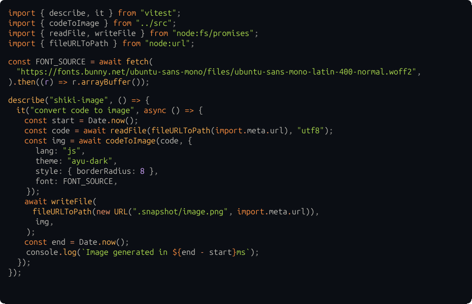

# shiki-image

<!-- automd:badges color=yellow -->

[](https://npmjs.com/package/shiki-image)
[](https://npm.chart.dev/shiki-image)

<!-- /automd -->

Convert code snippets into images. Powered by [shiki](https://github.com/shikijs/shiki) and [takumi](https://github.com/kane50613/takumi). Super fast 🚀

**Example:** (generated in **~150ms**)

<p align="center">
  
</p>

> [!NOTE]
> This was a quick experimental project. Contributors needed!

## Usage

```js
import { writeFile } from "node:fs/promises";
import { codeToImage } from "shiki-image";

const buffer = await codeToImage('console.log("hello, world!");', {
  lang: "js",
  theme: "ayu-dark",
  style: { borderRadius: 8 },
  font: "https://fonts.bunny.net/ubuntu-sans-mono/files/ubuntu-sans-mono-latin-400-normal.woff2",
});

await writeFile("image.png", buffer);
```

## Options

### `lang`

Code language. See [shiki supported languages](https://shiki.style/languages)

### `theme`

Rendering theme. See [shiki supported theems](https://shiki.style/themes).

### `style`

Additional container styles. See [takumi stylesheets](https://takumi.kane.tw/docs/deep-dives/stylesheets).

### `font`

Font used to render the code. Can be either a string (remote URL to fetch) or an ArrayBuffer.

### `width`

Rendering width. By default is computed as `(columns + 2) * 10`.

### `height`

Rendering height. By default is computed as `(lines + 2) * 20`.

## Development

<details>

<summary>local development</summary>

- Clone this repository
- Install latest LTS version of [Node.js](https://nodejs.org/en/)
- Enable [Corepack](https://github.com/nodejs/corepack) using `corepack enable`
- Install dependencies using `pnpm install`
- Run interactive tests using `pnpm dev`

</details>

## License

Published under the [MIT](https://github.com/unjs/shiki-image/blob/main/LICENSE) license.
