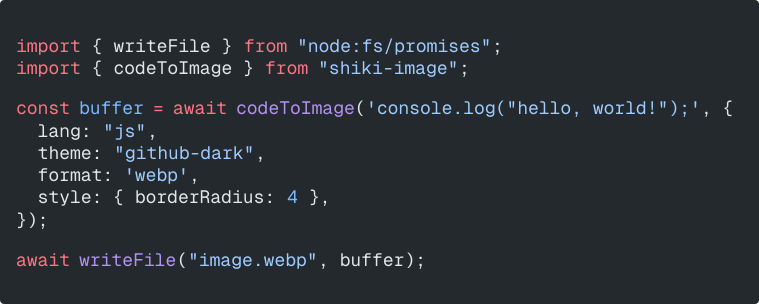

# shiki-image

<!-- automd:badges color=yellow -->

[](https://npmjs.com/package/shiki-image)
[](https://npm.chart.dev/shiki-image)

<!-- /automd -->

Convert code snippets into images. Powered by [shiki](https://github.com/shikijs/shiki) and [takumi](https://github.com/kane50613/takumi). Super fast 🚀

**Example:**

<p align="center">
  
</p>

> [!NOTE]
> This was a quick experimental project. Contributors needed!

## Usage

```js
import { writeFile } from "node:fs/promises";
import { codeToImage } from "shiki-image";

const buffer = await codeToImage('console.log("hello, world!");', {
  lang: "js",
  theme: "github-dark",
  format: "webp",
});

await writeFile("image.webp", buffer);
```

## Options

### `lang`

Code language. See [shiki supported languages](https://shiki.style/languages)

### `theme`

Rendering theme. See [shiki supported theems](https://shiki.style/themes).

### `style`

Additional container styles. See [takumi stylesheets](https://takumi.kane.tw/docs/deep-dives/stylesheets).

### `format`

Output format can be either `png`, `webp`, `avif`, or `jpeg` (default is `webp`).

### `quality`

Image quality between `0` to `100` (jpeg format only)

### `font`

Font used to render the code. Can be either a string (remote URL to fetch) or an ArrayBuffer.

> [!NOTE]
> If no font is specified, it will use the builtin `Geist Mono` font from Takumi.

> [!TIP]
> If a URL is passed, response will be cached in memory for the next renders.

### `fontRatio`

Font ratio used to compute the final font size. Default is `0.63`.

### `width`

Rendering width. By default is computed as `columns * fontSize * fontRatio`.

> [!NOTE]
> Default font size is `18` and can be customized using `style.fontSize`.

### `height`

Rendering height. By default is computed as `lines * fontSize * lineHeight`.

> [!NOTE]
> Default lineHeight is `1.3` and can be customized using `style.lineHeight`.

## Development

<details>

<summary>local development</summary>

- Clone this repository
- Install latest LTS version of [Node.js](https://nodejs.org/en/)
- Enable [Corepack](https://github.com/nodejs/corepack) using `corepack enable`
- Install dependencies using `pnpm install`
- Run interactive tests using `pnpm dev`

</details>

## License

Published under the [MIT](https://github.com/unjs/shiki-image/blob/main/LICENSE) license.
